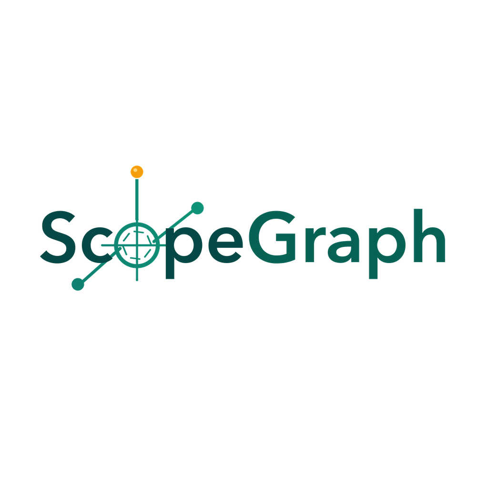
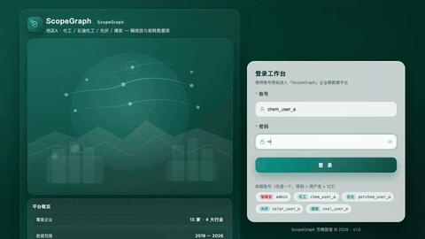
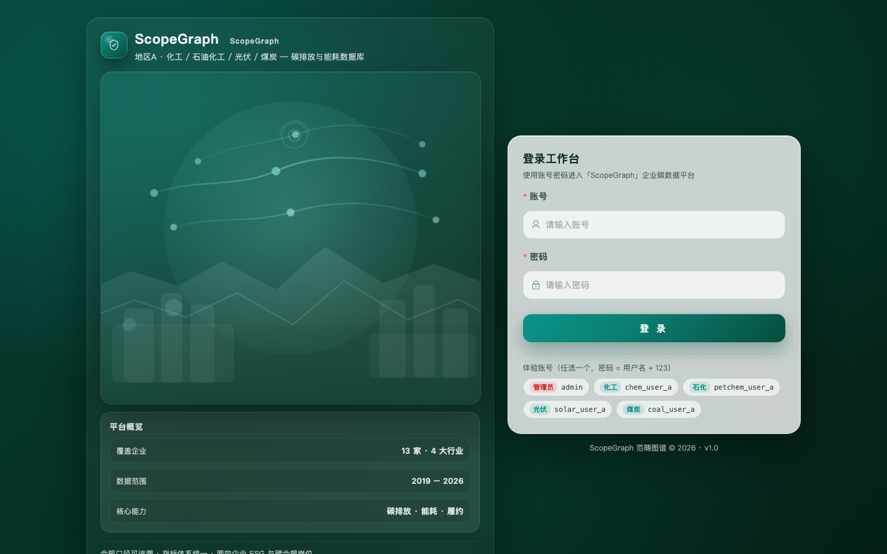
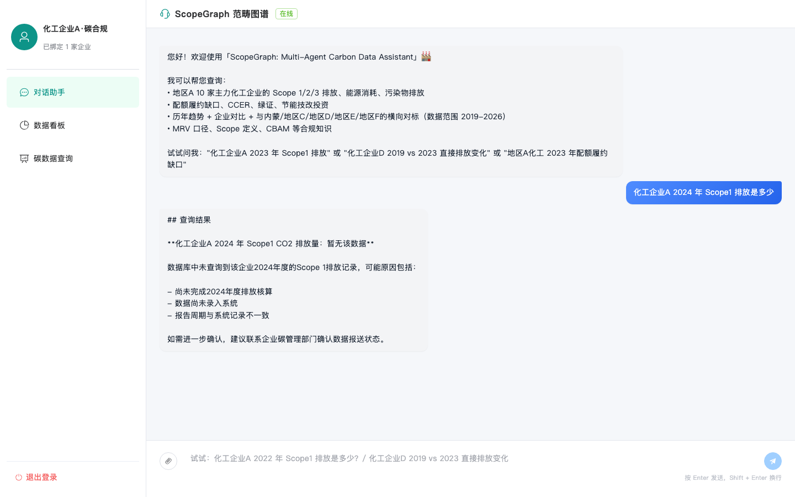
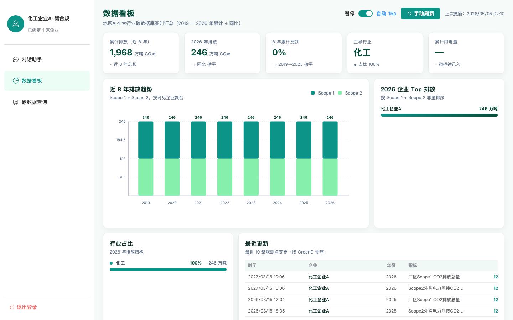
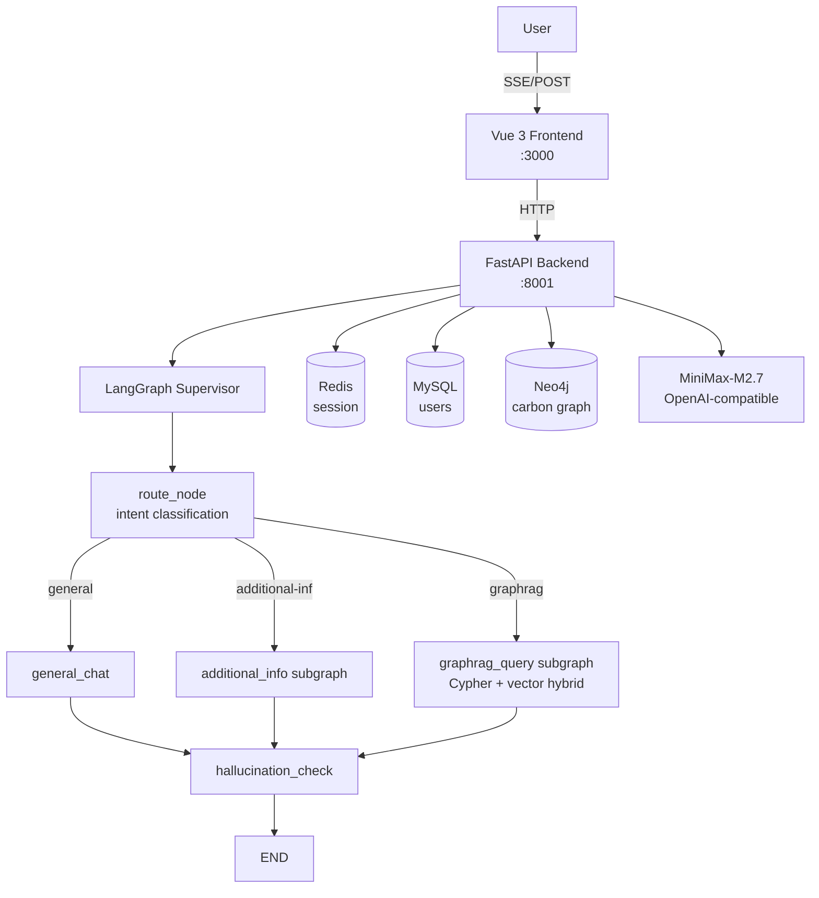

<p align="center">
  
</p>

<h1 align="center">ScopeGraph</h1>

<p align="center">
  <em>A multi-agent, GraphRAG-powered carbon-data assistant.<br>
  Scoped retrieval, scoped permissions, scoped emissions — all on one knowledge graph.</em>
</p>

<p align="center">
  
</p>

<p align="center">
  <a href="assets/demo.mp4">▶︎ Full 50-second product tour (MP4)</a>
</p>

## Screenshots

<table>
  <tr>
    <td align="center" width="33%">
      <br>
      <sub><b>Login</b><br>B2B split layout with demo account hints</sub>
    </td>
    <td align="center" width="33%">
      <br>
      <sub><b>Chat</b><br>Streaming reply with structured data table</sub>
    </td>
    <td align="center" width="33%">
      <br>
      <sub><b>Dashboard</b><br>KPIs, trends, ranking — all placeholder data (123)</sub>
    </td>
  </tr>
</table>

<p align="center">

[](LICENSE)
[](https://www.python.org/)
[](https://github.com/langchain-ai/langgraph)
[](https://vuejs.org/)

</p>

> ScopeGraph is a conversational carbon-emissions data assistant built on a LangGraph multi-agent supervisor and a Neo4j knowledge graph. The name reflects three layers it scopes:
>
> 1. **Scope 1 / 2 / 3** — the GHG-Protocol emission scopes the data covers
> 2. **Scope of access** — strict per-user data boundaries enforced through three layers (JWT → state → Cypher whitelist)
> 3. **Scope of retrieval** — hybrid Text-to-Cypher + vector search over a single graph
>
> Ask natural-language questions ("What was Chemical Enterprise A's 2024 Scope 1 emissions?") and receive structured answers with units, sources, comparisons, and interpretation.

面向化工行业碳排放、能源消耗与履约数据的**对话式查询平台**。
输入自然语言问题，返回带单位、来源、对比与解读的结构化答案。

---

## Highlights

- **Supervisor + 5 sub-agents** orchestrated via LangGraph: intent routing, ambiguity resolution, GraphRAG retrieval, file/image handling
- **Hybrid retrieval**: Text2Cypher (structured Neo4j) + multilingual vector search (`paraphrase-multilingual-MiniLM-L12-v2`)
- **Strict per-user data isolation**: 3-layer enforcement (JWT claims → graph state → injected Cypher whitelist)
- **Anti-hallucination**: small-model independent grounding judge + warning annotation
- **Streaming**: Server-Sent Events with 5-layer fallback (3 stream attempts + 2 non-stream retries)
- **Reasoning-model friendly**: strips `<think>...</think>` blocks; `structured_output` falls back through 3 methods (`json_schema` → `function_calling` → manual JSON parse)
- **Real RBAC**: admin sees all enterprises; per-tenant accounts can only query their bound enterprise

## Architecture



See [docs/architecture.md](docs/architecture.md) for design decisions.

## Quick Start (macOS)

```bash
# 1. Install services (one-time)
brew install redis mysql neo4j
brew services start redis mysql neo4j

# 2. Set service passwords
mysqladmin -uroot password 'change-me'
cypher-shell -u neo4j -p neo4j -d system "ALTER CURRENT USER SET PASSWORD FROM 'neo4j' TO 'change-me';"

# 3. Backend
conda create -n aics python=3.11 -y && conda activate aics
cd backend && pip install -r requirements.txt && cp ../.env.example .env
# Edit .env: set LLM_API_KEY, all <change-me> passwords, JWT_SECRET_KEY (use `openssl rand -hex 32`)
python -m uvicorn app.main:app --port 8001

# 4. Seed data + start frontend (new shell)
python scripts/init_mysql.py
python scripts/import_neo4j.py
cd frontend && npm install && npm run dev   # http://localhost:3000
```

For Linux: see [docs/native-setup.md](docs/native-setup.md). For Windows: [docs/windows-wsl2.md](docs/windows-wsl2.md).

## Try It

After login (any seeded account), ask:

```
你好，介绍一下你能查什么数据
化工企业A 2024 年 Scope1 排放是多少？
化工企业A 2019 到 2024 年 Scope1 怎么变化的？
化工企业D 和化工企业H 2023 年直接排放对比一下
2023 年地区A 化工 Scope1 排放最高的企业
什么是 Scope 1/2/3？
CBAM 对化肥企业有什么影响？
```

中文与英文均可，回答会跟随提问语言。

## Demo Data Notice

> **All numeric values in this repository are placeholders (filled with `123`).**
> Company names, regions, and personal data have been anonymized.
> The data demonstrates schema and pipeline; replace with your real MRV data for production use.

仓库中所有数值均为脱敏占位符（统一填充为 `123`），企业、地区、人员均已匿名化。
本仓库展示的是 schema 与对话管线；正式合规分析请接入真实 MRV 台账。

## Project Structure

```text
.
├── README.md  ·  LICENSE  ·  ACKNOWLEDGMENTS.md  ·  CONTRIBUTING.md
├── .env.example
├── backend/
│   ├── app/
│   │   ├── api/         auth, chat, profile, data, health endpoints
│   │   ├── graph/       LangGraph supervisor + sub-agents
│   │   │   ├── nodes/   router, hallucination, general_chat, file_query, image_query
│   │   │   └── subgraphs/  additional_info, graphrag_query
│   │   ├── knowledge/   Neo4j client, schema introspection, hybrid search
│   │   ├── memory/      Redis session manager, lifecycle, user profile
│   │   ├── safety/      input sanitizer, output audit, escalation
│   │   ├── prompts/     router/guardrails/planner/chat prompts
│   │   ├── models/      Pydantic schemas, SQLAlchemy ORM, agent state
│   │   └── utils/       MiniMax-tuned LLM helpers, fallback rules
│   ├── tests/           37 unit tests
│   └── requirements.txt
├── frontend/
│   └── src/             Vue 3 + Pinia + Element Plus
├── data/
│   ├── neo4j/           CSV bootstrap for the carbon graph (8 categories, 35 indicators, 23 enterprises)
│   └── knowledge/       Markdown methodology + FAQ (Scope definitions, CBAM, regional context)
├── scripts/
│   ├── init_mysql.py   Seed user accounts (admin + 5 per-tenant accounts)
│   └── import_neo4j.py Bootstrap the graph from CSVs
└── docs/
    ├── architecture.md     Multi-agent design + permission model
    ├── data-model.md        Neo4j schema reference
    ├── api.md               REST + SSE endpoint reference
    ├── native-setup.md      Linux equivalents (apt/yum)
    └── windows-wsl2.md      Windows via WSL2
```

## Configuration

All configuration via `.env` (copy from `.env.example`). Key variables:

| Variable | Default | Notes |
|----------|---------|-------|
| `LLM_API_KEY` | _(required)_ | Get one at https://platform.minimaxi.com |
| `LLM_MODEL` | `MiniMax-M2.7` | Any OpenAI-compatible chat model |
| `LLM_BASE_URL` | `https://api.minimaxi.com/v1` | Swap for local LM Studio etc. |
| `NEO4J_*_PASSWORD` | `<change-me>` | Set after `brew services start neo4j` |
| `JWT_SECRET_KEY` | _(required)_ | Generate with `openssl rand -hex 32` |
| `PORT` | `8001` | Backend port |

切换到本地大模型（LM Studio / Ollama）只需修改 `LLM_BASE_URL` 与 `LLM_MODEL`，无需改一行代码。

## Documentation

- [Architecture & Design Decisions](docs/architecture.md)
- [Neo4j Data Model](docs/data-model.md)
- [API Reference](docs/api.md)
- [Linux Setup](docs/native-setup.md)
- [Windows / WSL2 Setup](docs/windows-wsl2.md)

## Tests & Quality

```bash
cd backend && pytest tests/ -v    # 37 tests
mypy app --strict --ignore-missing-imports
cd ../frontend && npx vue-tsc --noEmit
```

## License

[MIT](LICENSE) © 2026 AntColony

## Acknowledgments

本项目的多 Agent 编排架构思想学习参考自
[AIRobsProtector/AIconverstionSys](https://github.com/AIRobsProtector/AIconverstionSys)，
所有源码独立实现，在此致谢原作者的设计思路。

构建于以下开源项目（均为 MIT/Apache 协议）：
- **LangGraph / LangChain** — multi-agent orchestration
- **Microsoft GraphRAG** — hybrid retrieval inspiration
- **FastAPI · Vue 3 · Element Plus · Pinia · Axios**
- **Neo4j Community · Redis · MySQL**
- **bcrypt · PyJWT · sentence-transformers · pdfplumber · python-docx · openpyxl**

See [ACKNOWLEDGMENTS.md](ACKNOWLEDGMENTS.md) for the full dependency list with licenses.
